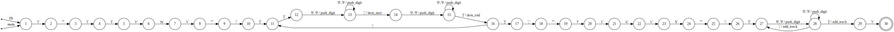

# Write-Up

As part of the [CoveoBlitz 2021](https://2021.blitz.codes/) competition registration, we had a couple of weeks to
write a solution that solves a particular challenge (sum of sequential numbers) as fast as possible.

While only 75 points were required to be accepted, there was a leaderboard of each team's maximum score...

After a very close race with the `PinaAplle` team through the entire event, we ended up in first position at 224.92 points,
with only a 0.01 points advantage!

## The Challenge

We're given distances on a train `track`, where each number is the distance between stations, e.g.:
```
Station #: 0    1     2     3     4     5     6   (those are implicit)
 Distance: <-2-> <-1-> <-5-> <-3-> <-2-> <-3->    (this is what we receive, as a list)
```

We also receive `items`, i.e. a list of "queries" for distances between stations on the track, e.g.:
```
(0, 2): Distance between station #0 and #2? 2 + 1, so return 3
(1, 5): 1 + 5 + 3 + 2 = 11
```
We receive multiple queries that we must answer at once.
Note: the `start`/`end` of queries are not necessarily `start<end`.

The faster we provide the right answer, the more points we get. So this ends up being an optimization challenge.

### Scoring

In practice, we provide a zipped solution to the server. Our solution is an HTTP server that receives a `track` and `items` (as JSON),
and returns list of integers (distance for each `(start, end)` query in `items`).
The server sends us 75 challenges like that (via HTTP POSTs).

The server measures how many seconds it took us to give the right answer. Each challenge gets a score of `3 - time_s` (min 0)
when the answer is right. Thus, the theoretical maximum (assuming no network latency and no processing time) would be `75 * 3 = 225pts`.

So, when we say that we're on the leaderboard at 224.92 pts, it means that it took us 80ms total to answer the 75 challenges.

## 3-Line Python 200pts Solution
The infrastructure supports 5 languages, each with a skeleton implementation that takes care of the HTTP server setup and JSON parsing:

- Python
- JS
- Typescript
- Java
- C#

We picked Python and started with an initial brute-force implementation to test out the infrastructure:

```py
track, queries = challenge["track"], challenge["queries"]
queries = ((min(start, end), max(start, end)) for start, end in queries)
return [sum(track[start:end]) for start, end in queries]
```

This surprisingly already gave 200pts!

We then looked into fancier approaches, including using [skip-lists to do the sequential sum](https://arxiv.org/ftp/arxiv/papers/1404/1404.1560.pdf),
but that was really just slower. Ultimately it became obvious that this was not necessary at all: all we have to do is keep track of
"what's the distance from `0` to `n`?" for all `n`, then the distance from `a` to `b` (`a<b`) is `distance(0, b) - distance(0, a)`.

In other words:

```py
track, queries = challenge["track"], challenge["queries"]
queries = ((min(start, end), max(start, end)) for start, end in queries)
running_sum = [0] * (len(track) + 1)
for i, x in enumerate(track):
  running_sum[i+1] = running_sum[i] + x
return [running_sum[end] - running_sum[start] for start, end in queries]
```

Doesn't sound like we can speed up much more than that...

Right?

## Measuring & Challenge Structure

At this point, iterating on ideas is pretty slow -- need to zip, upload to the server, wait until ready, launch, wait for the results.

So we added print statements to our program to output each challenge on the server (it was possible to download logs after a run), and saved
2 sets of 75 challenges to a file. We then wrote a local benchmarking tool that contacts our server (locally) and runs each challenge
multiple times and reports the median speed (see [`benchmark`](./benchmark)) for all to estimate what score we'd get.

Additionally, we found out here that the structure of the challenges is very regular:
```
Challenges:
1x   track size 10,   10   queries
10x  track size 100,  100  queries
15x  track size 1500, 1500 queries
15x  track size 200,  100k queries
14x  track size 10k,  10k  queries
1x   track size 10,   10   queries
10x  track size 100,  100  queries
9x   track size 1500, 1500 queries
```

As an example, our timings/score on those tasks at some point looked like:
```
Our local benchmark tool (on an Intel i7-4600U 2.10GHz) shows, for different sizes of problems:
track 10,    queries 10:     0.92ms  3.00pts
track 100,   queries 100:    0.92ms  3.00pts
track 1500,  queries 1500:   0.98ms  3.00pts
track 200,   queries 100000: 3.67ms  2.99pts
track 10000, queries 10000:  1.32ms  3.00pts
```

So we can see that speeding up the 100k queries use-case is worth it, for example...

## Python-ish
At this point, iterating over 100k integers and outputing a list of 100k elements in Python isn't free:
```
> python3 -m timeit '[x for x in range(100000)]'
50 loops, best of 5: 5.89 msec per loop
```

We decided to move the logic to a C++ function that we [call from Python](https://docs.python.org/3/library/ctypes.html).

Profiling highlighted that JSON parsing was then our next bottleneck. We changed the Python logic to send the raw JSON
string to our C++ function, which would "parse" it to extract the `track` and `items`. We put parse in quotes, because
we baked in a lot of assumptions about the format to directly extract just a long sequence of ints that we could break
down into track/items.

A couple of optimizations from there:
- Manually reading numbers in a hard-coded while-loop was faster than using std calls (we can bake in our assumptions);
- Everything is single-thread, so we can use static memory instead of allocating on-the-fly;
- Compiling once with [`PGO`](https://en.wikipedia.org/wiki/Profile-guided_optimization) to gather run-time information
  to guide optimization the next time we compile.

We played with multithreading the processing, since `std::thread::hardware_concurrency()` showed `2`, but without success.
We later found out (through reading CPU information in a test run) that we had 2 vCPUs with hyper-threading (which
[hurts](https://www.credera.com/insights/whats-in-a-vcpu-state-of-amazon-ec2-in-2018/)).

We sped up our int-to-string conversions (to output the final distances as "JSON") with inspiration from
[this blog post](https://www.zverovich.net/2020/06/13/fast-int-to-string-revisited.html), which showed that
[`fmt`](https://fmt.dev/latest/index.html) was very promising. Interestingly, it
[outputs 2 digits at a time](https://github.com/fmtlib/fmt/blob/a30b279bad752ff4c4967c6d1bfcfc8d79c6b170/include/fmt/format.h#L1052)
(using a hard-coded `int->2 chars` array) to minimize the amount of divisions, where the idea comes from a
talk by Andrei Alexandrescu
["Three Optimization Tips for C++"](https://www.slideshare.net/andreialexandrescu1/three-optimization-tips-for-c).

At that point, it turned out that most of the time was spent _outside_ of our C++ implementation. Could the default
`flask` HTTP processing be costing us? We tried switching from `flask` to
[`falcon`](https://falcon.readthedocs.io/en/stable/), and that gave us a pretty significant speed up...

## "Python"

Our only contract with the testing infrastructure is that they launch our program through Python. We switched our python
program to be nothing more than a trampoline to our real C++ implementation. So it would only make a call to our function,
which would then take over, bind to the port, and take care of replying to the traffic through raw sockets.

So we wrote a very hard-coded HTTP server filled with assumptions to speed things up.

From there, the fact that we had to read/write more than a megabyte of data for some challenges
(e.g. `2*100k ints for queries` with a lot of separators) meant that it would probably be worth reading the input in chunks,
making use of a [state machine](http://www.colm.net/open-source/ragel/) to process a chunk at a time while the data was still
in-flight.

Here's what the state machine looked like:



TODO(will): numbers.h
TODO(will): analysis of cache hits/misses

One very cool idea that we [read about](https://kholdstare.github.io/technical/2020/05/26/faster-integer-parsing.html)
to quickly parse the data to ints (one of our bigger bottlenecks), was the use of SIMD to parse multiple characters at
once (even with unknown int lengths): [details](http://0x80.pl/articles/simd-parsing-int-sequences.html). Unfortunately, to
do so we had to read all the data at once (hence get rid of continuous processing while reading), which turned out to
be slower. Very neat idea, though!

In conclusion, this was a super fun challenge. It was surprising that the difficulty lied completely outside of the
problem we had to solve, but was very interesting and we learned quite a bit. It's great that we start from 3 lines
of Python and end up with a trampoline Python that just launches a C++ hard-coded HTTP server with raw sockets that
works hard to extract ints out of JSON continuously with a state machine, does a tiny bit of work with them (what
we're really supposed to solve), and outputs back a string as fast as possible, all for an extra `24.92 pts` on the
scoreboard.

# Development

See https://2021.blitz.codes/.

Really, see the doc on [python/cpp/main.c](./python/cpp/main.c), it explains
the challenge, what we do, and where we should improve.

## Benchmarking

Launch the server:

```sh
$ cd python
$ make && python3 application.py
```

Launch the benchmark tool:

```sh
$ cd benchmark
$ python3 bench.py --verify
```

If you are just testing potential speeds without fully implementing everything
(and don't want to check answers), remove `--verify`.

NOTE: This does end-to-end tests from an external client. If you want benchmark
timers from the program itself, switch the `PROFILE_ENABLED` define in [config.h](./python/cpp/config.h)
to `1`.

## Submitting

You have a good candidate?

Remove prints. Have `PROFILE_ENABLED` set to `0`.

Go in [`Makefile`](./python/cpp/Makefile), uncomment the line to generate the
[PGO](https://en.wikipedia.org/wiki/Profile-guided_optimization) profile
(`-fprofile-generate`). Recompile with `make scrub && make`. Run the server
with the benchmark tool for a full challenge set.

Recompile using `make clean && make`, but now using the profile generated
(`-fprofile-use`).

Zip your `python` folder and submit on the website. Wait until the build is
done. Click on `Launch`, and wait!

**RUN MULTIPLE TIMES.** There is a lot of variation on the server. Up to ~0.05
pts even. Just rerun a couple of times to be sure.
